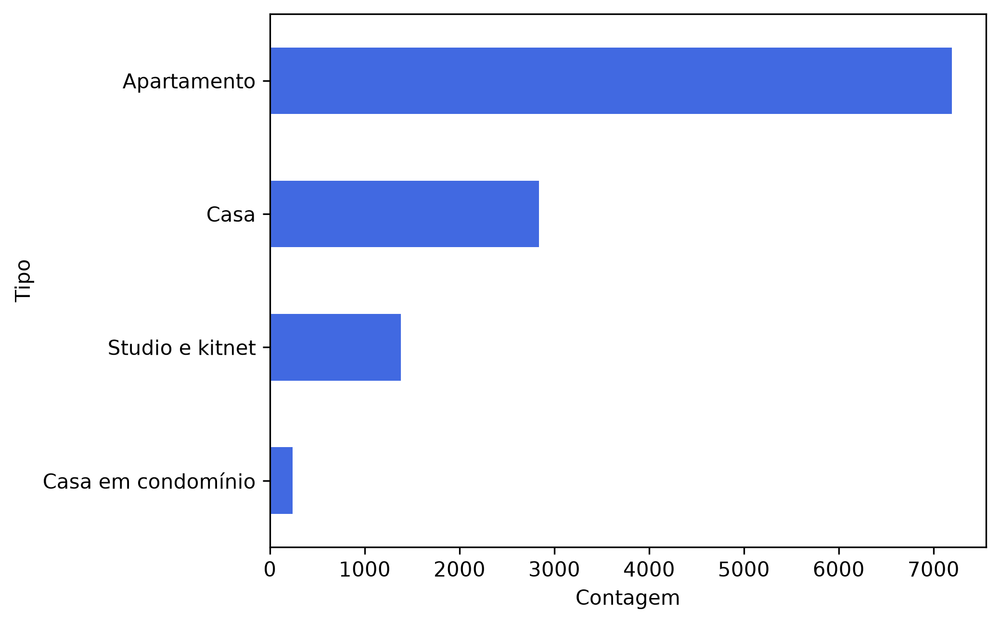
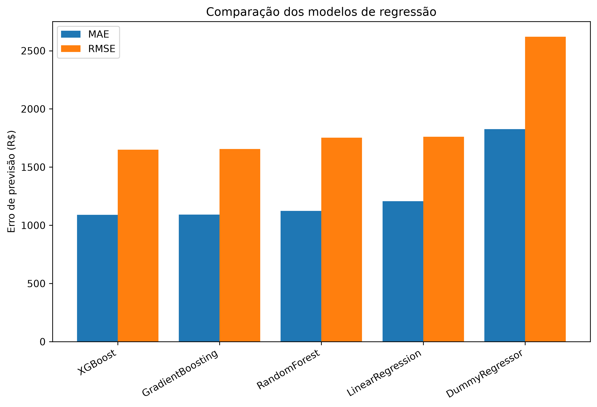

# 🏠 Predição de Preços de Aluguel de Imóveis em São Paulo

Projeto de Machine Learning desenvolvido para investigar a capacidade de prever o valor de aluguel de imóveis residenciais na cidade de São Paulo a partir de características estruturais dos imóveis.

O projeto apresenta um fluxo completo de Ciência de Dados, desde a compreensão e exploração dos dados até a preparação, modelagem, avaliação e experimentação de melhorias, com atenção especial à prevenção de **data leakage**, análise de erros e validação cruzada.

---

## 🎯 Objetivo

Investigar a capacidade de modelos de Machine Learning em prever o valor de aluguel de imóveis utilizando características como:

- Área;
- Número de quartos;
- Número de vagas de garagem;
- Tipo de imóvel.

Além da construção do modelo preditivo, o projeto buscou investigar se técnicas de **Feature Engineering** poderiam fornecer informações adicionais sobre imóveis de maior padrão e, consequentemente, melhorar a capacidade preditiva dos modelos.

---

## 📊 Dataset

O dataset utilizado contém informações sobre imóveis residenciais da cidade de São Paulo.

Principais variáveis:

| Variável | Descrição |
|---|---|
| `address` | Endereço do imóvel |
| `district` | Bairro/região |
| `area` | Área do imóvel |
| `bedrooms` | Número de quartos |
| `garage` | Número de vagas |
| `type` | Tipo do imóvel |
| `rent` | Valor do aluguel |
| `total` | Valor total associado ao anúncio |

O dataset possui **11.657 registros** subdividos em:


Durante a análise exploratória e a etapa de limpeza, foram identificadas características importantes como:

- distribuição assimétrica dos valores de aluguel;
- presença de valores extremos;
- grande heterogeneidade entre os tipos de imóveis;
- elevada cardinalidade da variável `district`;
- possíveis inconsistências em algumas variáveis.

A variável `rent` foi utilizada como variável-alvo. A variável `total` foi excluída da modelagem devido ao risco de **data leakage**.

Embora `district` possa possuir forte relação com o valor do aluguel, a variável não foi incorporada ao modelo final. A utilização direta do bairro exigiria uma estratégia adequada para representar a localização sem introduzir informações derivadas do próprio valor do aluguel ou criar representações pouco robustas para bairros com poucas observações.

---

## 🔬 Metodologia

O projeto foi dividido em seis etapas principais, documentadas individualmente nos notebooks.

### 01 — Data Understanding

Análise inicial da estrutura e qualidade dos dados.

Foram investigados:

- dimensões do dataset;
- tipos das variáveis;
- valores ausentes;
- estatísticas descritivas;
- cardinalidade das variáveis categóricas;
- possíveis inconsistências.

📓 [Acessar notebook — Data Understanding](notebooks/01_data_understanding.ipynb)

---

### 02 — Exploratory Data Analysis

Investigação das distribuições e relações entre as variáveis.

Foram analisadas principalmente as relações entre:

- aluguel e área;
- aluguel e quartos;
- aluguel e vagas;
- aluguel e tipo de imóvel.

Também foram avaliadas medidas de assimetria e curtose, contribuindo para a compreensão da distribuição dos dados e da presença de valores extremos.

📓 [Acessar notebook — Exploratory Data Analysis](notebooks/02_exploratory_data_analysis.ipynb)

---

### 03 — Data Cleaning

Tratamento e preparação dos dados para modelagem.

Um dos principais cuidados foi diferenciar **outliers legítimos** de possíveis erros de registro.

Valores elevados de aluguel não foram removidos automaticamente, pois podem representar imóveis reais de alto padrão. Dessa forma, a decisão de remover registros extremos não foi tomada apenas com base em critérios estatísticos.

Também foram removidas variáveis que não seriam utilizadas na modelagem final e a variável `total` foi excluída devido ao risco de **data leakage**.

📓 [Acessar notebook — Data Cleaning](notebooks/03_data_cleaning.ipynb)

---

### 04 — Feature Engineering

Foram desenvolvidas features para investigar se seria possível identificar imóveis de alto padrão a partir de suas características estruturais.

Foram exploradas duas abordagens:

- `high_standard`, baseada em um score global;
- `high_standard_type`, baseada em um score calculado dentro de cada tipo de imóvel.

Essas features foram posteriormente avaliadas experimentalmente durante a etapa de melhoria do modelo.

📓 [Acessar notebook — Feature Engineering](notebooks/04_feature_engineering.ipynb)

---

### 05 — Modeling

Nesta etapa foram comparados cinco modelos de regressão:

- `DummyRegressor`;
- `LinearRegression`;
- `RandomForestRegressor`;
- `GradientBoostingRegressor`;
- `XGBRegressor`.

O objetivo desta etapa foi estabelecer um **baseline de modelagem** antes da realização dos experimentos de Feature Engineering.



O **XGBoost apresentou o melhor desempenho inicial**.

| Modelo | MAE | RMSE | R² |
|---|---:|---:|---:|
| **XGBoost** | **R$ 1.089** | **R$ 1.649** | **0,604** |
| Gradient Boosting | R$ 1.093 | R$ 1.656 | 0,601 |
| Random Forest | R$ 1.124 | R$ 1.753 | 0,552 |
| Linear Regression | R$ 1.207 | R$ 1.761 | 0,548 |
| Dummy Regressor | R$ 1.826 | R$ 2.620 | ≈ 0 |

Os modelos baseados em árvores e boosting apresentaram desempenho superior à regressão linear, sugerindo que as relações entre as características dos imóveis e o valor do aluguel possuem componentes não lineares.

O XGBoost apresentou o menor MAE e RMSE, embora sua vantagem em relação ao Gradient Boosting tenha sido pequena. A análise dos maiores erros absolutos revelou que o modelo apresentava dificuldades principalmente na previsão de imóveis com valores elevados de aluguel, frequentemente subestimando imóveis na faixa de R$ 10.000 a R$ 15.000.

Esse comportamento motivou a investigação de features relacionadas à identificação de imóveis de maior padrão.

📓 [Acessar notebook — Modeling](notebooks/05_modeling.ipynb)

---

### 06 — Model Improvement

O XGBoost foi selecionado para os experimentos de melhoria devido ao melhor desempenho observado na avaliação inicial.

Nesta etapa foi utilizada **K-Fold Cross Validation** para obter uma estimativa mais robusta do desempenho do modelo.

Foram comparados três experimentos:

1. XGBoost Baseline;
2. XGBoost + `high_standard`;
3. XGBoost + `high_standard_type`.

| Modelo | MAE médio | RMSE médio | R² médio |
|---|---:|---:|---:|
| **XGBoost Baseline** | **R$ 1.123,79** | **R$ 1.779,48** | **0,5460** |
| XGBoost + High Standard | R$ 1.122,70 | R$ 1.784,63 | 0,5435 |
| XGBoost + High Standard Type | R$ 1.124,56 | R$ 1.790,02 | 0,5411 |

A inclusão de `high_standard` apresentou uma pequena redução no MAE médio, porém foi acompanhada por piora no RMSE e no R².

A inclusão de `high_standard_type` não apresentou melhoria em relação ao baseline.

Portanto, nenhuma das features desenvolvidas produziu uma melhoria global consistente no desempenho do modelo.

📓 [Acessar notebook — Model Improvement](notebooks/06_model_improvement.ipynb)

---

## 🏆 Principais resultados

O **XGBoost** apresentou o melhor desempenho na avaliação inicial realizada no notebook de modelagem. Posteriormente, os experimentos de melhoria foram avaliados utilizando K-Fold Cross Validation.

O resultado de referência obtido na validação cruzada foi:

- **MAE médio:** R$ 1.123,79
- **RMSE médio:** R$ 1.779,48
- **R² médio:** 0,5460

Os experimentos com `high_standard` e `high_standard_type` não apresentaram ganhos globais consistentes.

A análise dos erros indicou que uma das principais dificuldades do modelo está relacionada à previsão de imóveis de maior valor, sugerindo que as características disponíveis no dataset não são suficientes para representar completamente os fatores associados ao segmento de alto padrão.

---

## 💡 Principais aprendizados

Este projeto permitiu aplicar conceitos importantes de um fluxo completo de Machine Learning:

- Data Understanding;
- Exploratory Data Analysis;
- Data Cleaning;
- Feature Engineering;
- Train/Test Split;
- StandardScaler;
- One-Hot Encoding;
- Pipelines;
- Regressão Linear;
- Random Forest;
- Gradient Boosting;
- XGBoost;
- MAE, RMSE e R²;
- Análise de erros;
- K-Fold Cross Validation;
- Prevenção de Data Leakage.

Um dos principais aprendizados foi compreender que **melhorar um modelo não significa necessariamente criar mais features ou utilizar um algoritmo mais complexo**.

Os experimentos realizados demonstraram que a capacidade de generalização também é limitada pela qualidade e pela riqueza das informações disponíveis no dataset.

Neste projeto, as features desenvolvidas para representar o padrão dos imóveis não produziram ganhos consistentes, indicando que novas informações — principalmente relacionadas à localização e às características qualitativas dos imóveis — provavelmente seriam mais relevantes para avançar o desempenho preditivo.

---

## ⚠️ Limitações

O dataset possui limitações importantes.

A localização detalhada, que provavelmente possui grande influência sobre o preço dos imóveis, não foi incorporada diretamente ao modelo final.

Além disso, não estão disponíveis informações como:

- localização geográfica precisa;
- distância até transporte público;
- infraestrutura da região;
- estado de conservação;
- qualidade do acabamento;
- mobiliário;
- características qualitativas do imóvel;
- amenidades do condomínio.

Essas informações poderiam contribuir para explicar parte dos erros observados, principalmente na previsão de imóveis de maior padrão.

Outra limitação importante é a ausência de informações temporais detalhadas, que poderiam permitir investigar variações do mercado imobiliário ao longo do tempo.

---

## 🛠️ Tecnologias

- Python
- Pandas
- NumPy
- SciPy
- Scikit-learn
- XGBoost
- Matplotlib
- Seaborn
- Jupyter Notebook
- Git
- GitHub

---

## 📁 Estrutura do projeto

```text
House-Prices-ML/
│
├── data/
│   ├── raw/
│   └── processed/
│
├── notebooks/
│   ├── 01_data_understanding.ipynb
│   ├── 02_exploratory_data_analysis.ipynb
│   ├── 03_data_cleaning.ipynb
│   ├── 04_feature_engineering.ipynb
│   ├── 05_modeling.ipynb
│   └── 06_model_improvement.ipynb
│
├── README.md
├── requirements.txt
├── pyproject.toml
└── .gitignore
```

---

## 🚀 Como executar

Clone o repositório:
git clone https://github.com/Marinopl/House-Prices-ML.git

Entre no diretório do projeto:
cd House-Prices-ML

Crie o ambiente virtual:
python -m venv .venv

Ative o ambiente virtual no Windows:
.venv\Scripts\Activate.ps1

Instale as dependências do projeto:
pip install -r requirements.txt

---

## 📚 Dados

O projeto utiliza o dataset São Paulo Housing Prices, disponibilizado por RenatoSN no Kaggle.

O conjunto de dados contém informações sobre imóveis residenciais da cidade de São Paulo e foi utilizado como base para as etapas de análise exploratória, limpeza dos dados, Feature Engineering e modelagem preditiva.

Fonte:

[São Paulo Housing Prices — Kaggle](https://www.kaggle.com/datasets/renatosn/sao-paulo-housing-prices)

---

## 👤 Autor

[Marino Paiva Lenzarini](https://github.com/Marinopl)

Projeto desenvolvido como parte da formação prática em Ciência de Dados, com foco em análise de dados, Machine Learning e desenvolvimento de modelos preditivos.